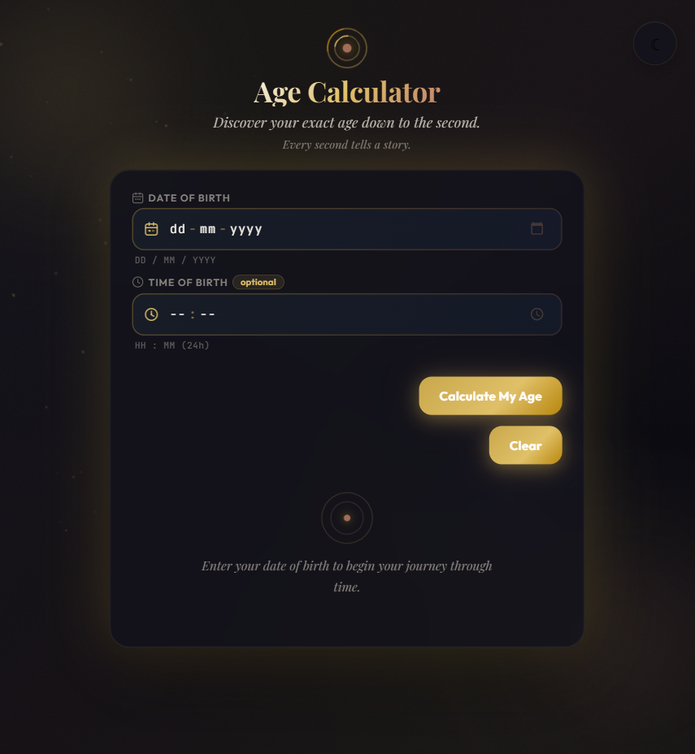

# ✨ Age Calculator — Every Second Tells a Story

<p align="center">
  <em>A premium real-time age calculator built with HTML, CSS & Vanilla JavaScript.</em>
</p>

<p align="center">
  <a href="https://abhik-kundu09.github.io/age-calc/">
    
  </a>
</p>

---

## 📖 Overview

Age Calculator is a modern, interactive web application that transforms a simple date of birth into a rich timeline of life statistics.

Instead of displaying only years and months, it continuously updates your age every second and presents meaningful insights, milestones, zodiac information, and fun facts through a visually engaging interface.

---

## 🌟 Features

### ⏳ Real-Time Age Tracking

* Live age updates every second
* Years, Months, Weeks, Days
* Hours, Minutes, Seconds

### 🎂 Birthday Intelligence

* Next birthday countdown
* Remaining Days, Hours, Minutes & Seconds
* Upcoming age milestone tracking

### ♈ Zodiac Insights

* Zodiac Sign Detection
* Element Classification
* Personality Keywords
* Date Range Information

### 📊 Life Milestones

* Estimated Heartbeats
* Total Breaths Taken
* Hours Slept
* Sunrises Witnessed
* Moon Cycles Completed

### 🎨 Premium User Experience

* Glassmorphism UI
* Aurora Background Effects
* Animated Particles
* Smooth Transitions
* Scroll Reveal Animations
* Tilt & Parallax Interactions

### ♿ Accessibility

* Semantic HTML Structure
* Keyboard Navigation Support
* ARIA Live Regions
* Reduced Motion Support
* Responsive Layout

---

## 🛠 Tech Stack

| Technology         | Purpose                   |
| ------------------ | ------------------------- |
| HTML5              | Structure                 |
| CSS3               | Styling & Animations      |
| Vanilla JavaScript | Logic & Live Calculations |

---

## 🚀 Live Demo

<p align="center">
  <a href="https://abhik-kundu09.github.io/age-calc/">
    
  </a>
</p>

---


## 📸 Preview

<a href="https://abhik-kundu09.github.io/age-calc/">
  
</a>


## 📂 Project Structure

```text
age-calc/
│
├── index.html
├── style.css
├── script.js
├── README.md
└── assets/
    ├── image.png
```

---

## ⚙️ How It Works

1. User enters Date of Birth.
2. Optional Time of Birth enhances accuracy.
3. JavaScript calculates elapsed time.
4. Live counters refresh every second.
5. Zodiac data and fun facts are generated dynamically.
6. Birthday countdown updates in real time.

---

## 📱 Responsive Design

Optimized for:

* Desktop
* Laptop
* Tablet
* Mobile Devices

---

## 👨‍💻 Author

**Abhik Kundu**

If you enjoyed this project, consider giving it a ⭐ on GitHub.
